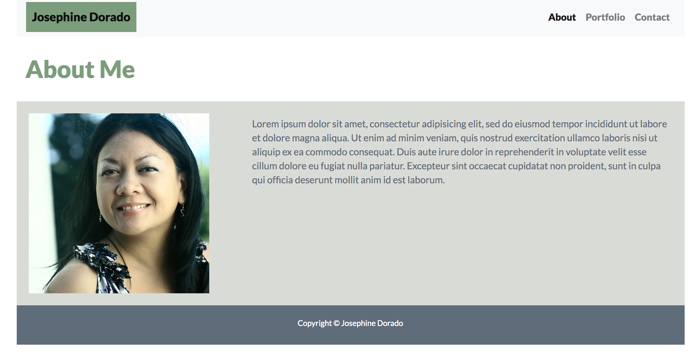
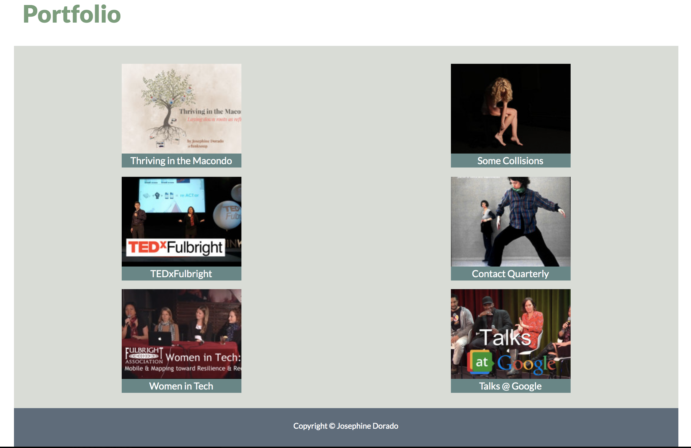
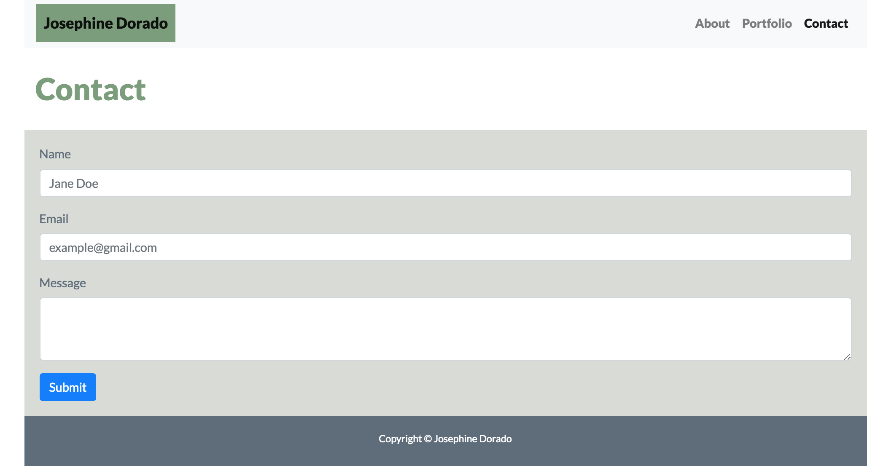
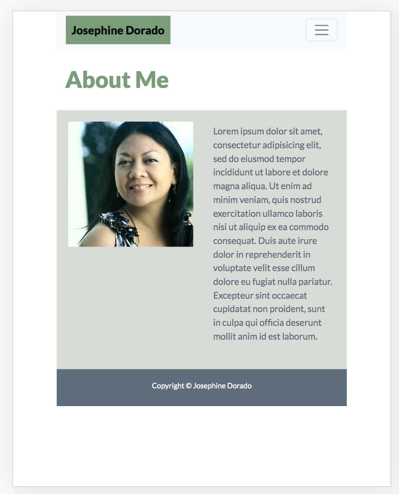
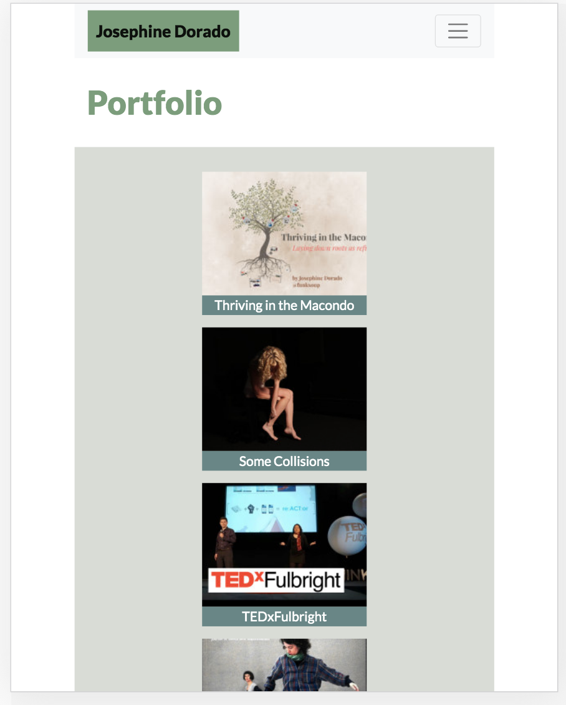
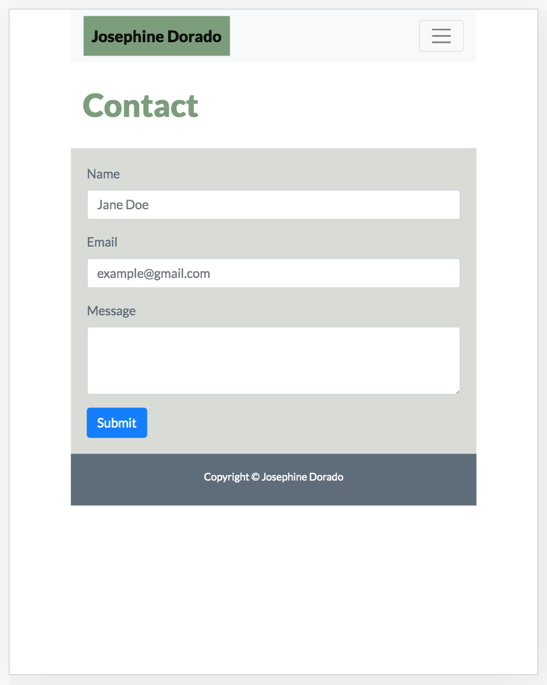

# Unit 02 CSS and Bootstrap: Responsive Portfolio

Responsive portfolio template with home, portfolio and contact pages, featuring a monochromatic color palette and thumbnail portfolio images that link to external pages.

## Tech/Framework Used

* Bootstrap 4.4.1

* JavaScript

## Usage

The following images demonstrate the application functionality:

* Desktop screenshots

* Mobile screenshots

## Contributing

Pull requests are welcome. For major changes, please open an issue first to discuss what you would like to change.

### Step 1

* Option 1:🍴 Fork this repo!

* Option 2: 👯 Clone this repo to your local machine using https://github.com/funksoup/02-Homework-CSS-Bootstrap.git

### Step 2

* HACK AWAY! 🔨🔨🔨

### Step 3

* 🔃 Create a new pull request using https://github.com/funksoup/02-Homework-CSS-Bootstrap/compare

